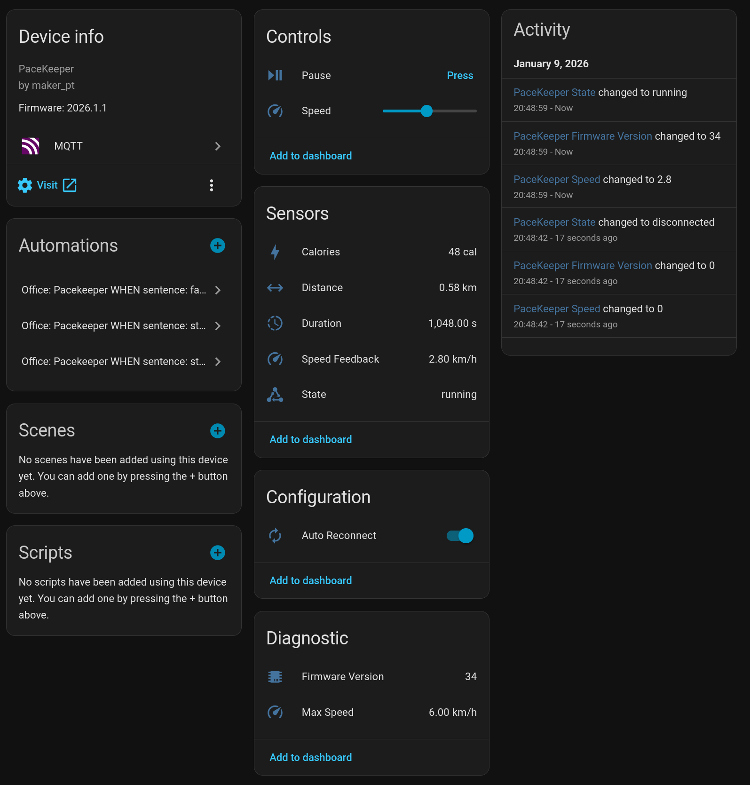

# Homebrain PaceKeeper for WalkingPads in Home Assistant (ESPHome edition)

> This is an ESPHome port of [peteh/pacekeeper](https://github.com/peteh/pacekeeper). The original project uses PlatformIO + MQTT; this fork replaces that with an ESPHome custom component and the native Home Assistant API — no MQTT broker required.

PaceKeeper is an ESPHome firmware for an ESP32 that connects via Bluetooth LE to your WalkingPad and exposes the treadmill to Home Assistant via the native ESPHome API.



See the video on Youtube:

[](https://www.youtube.com/watch?v=Pwt5jl2jNe4)

## Supported Hardware

* PitPat-T01 Treadmill – Superun BA06-B1 [[AliExpress](https://s.click.aliexpress.com/e/_c3V1ssrv)]
* Likely also: other Superun / Deerrun OEM models (same protocol)

## Required Tools

* An ESP32 with Bluetooth (e.g. Wemos S3 Mini, nodemcu-32s, …) [[AliExpress](https://de.aliexpress.com/item/1005006646247867.html)] [[Amazon](https://amzn.to/44VolhQ)]
* [ESPHome](https://esphome.io/) — either the Home Assistant add-on, the standalone Docker container, or the CLI
* Home Assistant with the [ESPHome integration](https://www.home-assistant.io/integrations/esphome/) (auto-discovered once the device joins WiFi)

## Exposed Entities

Once flashed, the device shows up in Home Assistant with:

| Entity            | Type          | Notes                                    |
| ----------------- | ------------- | ---------------------------------------- |
| Speed             | sensor        | current speed in km/h (from treadmill)   |
| Distance          | sensor        | total distance km                        |
| Duration          | sensor        | run duration in seconds                  |
| Calories          | sensor        | kcal                                     |
| Steps             | sensor        | step count (not all firmwares report)    |
| Max Speed         | sensor        | device-configured maximum                |
| Firmware Version  | sensor        | treadmill firmware                       |
| State             | text_sensor   | `running` / `paused` / `stopped` / …     |
| Speed Control     | number        | slider 0–6 km/h → sets target speed      |
| Start-Stop        | button        | toggles between run and stop             |

## Setup

### 1. Find the Bluetooth address of the treadmill

Install **nRF Connect** on your phone.

* Turn the treadmill on with the power switch
* Either initialize it with the vendor app or follow the *Cloud Free Usage* section below
* Open nRF Connect — the device should appear as `PitPat-T01`
* Write down the Bluetooth address (e.g. `AA:BB:CC:11:22:33`)

### 2. Configure the firmware

Copy the template and fill in your values:

```bash
cp esphome/esp-pacekeeper.example.yaml esphome/esp-pacekeeper.yaml
```

The real `esp-pacekeeper.yaml` is gitignored so your credentials stay out of the repo. Edit these fields:

```yaml
wifi:
  ssid: "<your WiFi SSID>"
  password: "<your WiFi password>"

ble_client:
  - mac_address: "AA:BB:CC:11:22:33"   # ← your treadmill's BT address
    id: walkingpad_ble
```

The YAML references a local custom component at `esphome/components/walkingpad/`. Copy that directory to your ESPHome config as well so the final layout is:

```
<esphome-config>/
├── esp-pacekeeper.yaml
└── components/
    └── walkingpad/
        ├── __init__.py
        └── walkingpad.h
```

### 3. Flash

From the ESPHome CLI or the Home Assistant add-on UI:

```bash
esphome run esp-pacekeeper.yaml
```

First flash needs to be over USB; subsequent updates work over-the-air.

Once the device joins WiFi, Home Assistant auto-discovers it via the ESPHome integration — just accept the new device.

## How it works

* The custom component `walkingpad` (in `esphome/components/walkingpad/`) inherits from `ble_client.BLEClientNode` and owns the WRITE characteristic `0xFBA1`, which it uses to send 23-byte speed/stop commands with an XOR checksum.
* Notifications on `0xFBA2` are subscribed via ESPHome's built-in `ble_client` sensor platform. Its lambda forwards the raw bytes into `WalkingPadComponent::on_notification()` where the binary packet is parsed and the entities are published.
* Connection parameters (15–30 ms interval, 6 s supervision timeout) match what the original vendor firmware expects — this prevents the ~30 s idle disconnect.

## Cloud Free Usage – Start Without WiFi, App, and Cloud Account

You'll get a remote with it; it has **+**, **−**, and **play/pause** buttons. However, when you turn it on, it initially reacts with a long, annoying sound to any button press. When you turn it on with the power button, it will also take a while before showing display information, first lighting up all display segments.

That's where you strike.

Turn it on and quickly press **(+)**; you will be greeted with a short sound. Then press **−, −, −, +, +**, wait **20 seconds**, turn it off and on again. It should now display something else, and you can start using it.

### Sequence

* Turn on using the `power` switch on the device
* Press `-` on the remote **3×**
* Press `+` on the remote **1×**
* Press `+` on the remote for **3 seconds**

Each correct input will be confirmed by a short, happy sound. Each incorrect input will be confirmed by a long, annoying sound.

Source:
<https://www.reddit.com/r/treadmills/comments/1jtuwix/heres_how_you_unlock_superun_treadmills_without/>

## Acknowledgements

I built this with the help of many other people who put effort into reverse-engineering the Bluetooth protocol.

### Web Bluetooth App (Python)

Python web interface to control the treadmill via Bluetooth but for another model.

GitHub project:
<https://github.com/azmke/pitpat-treadmill-control>

### Web Bluetooth App (JavaScript)

A Web Bluetooth app written in JavaScript. Fully supports the B1 as well.

GitHub project:
<https://github.com/KeiranY/PitPat-WebBT/>

### Zwift Integration by qdomyos

There is some work in a B1 sub-branch.

Source file:
<https://github.com/cagnulein/qdomyos-zwift/blob/master/src/devices/deeruntreadmill/deerruntreadmill.cpp>

## Further Notes

Deerrun and Superun seem to use the same OEM hardware, so it's likely that those devices might work as well.
